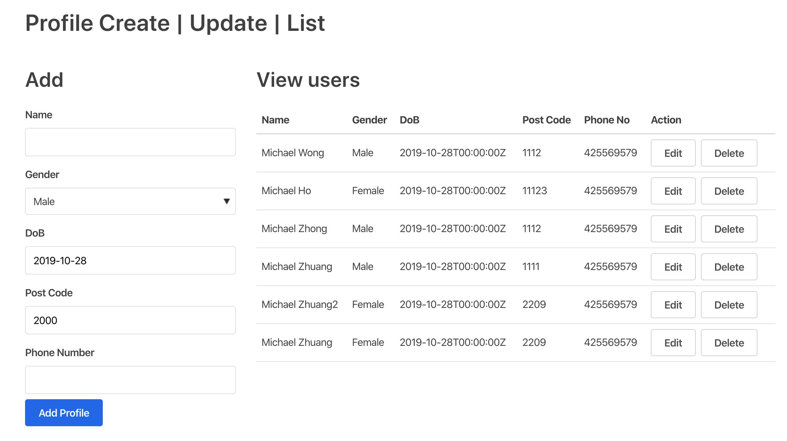
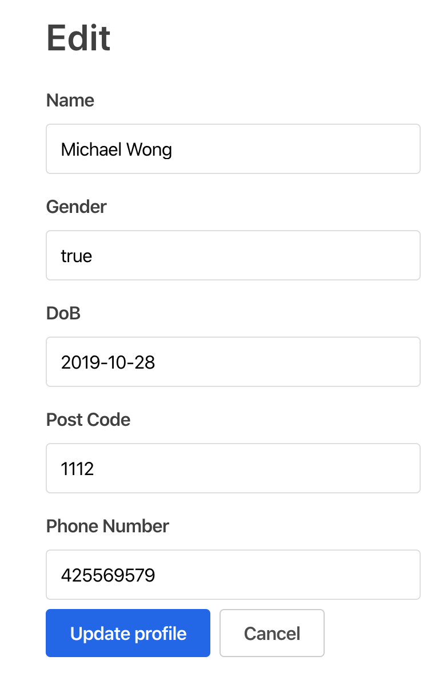

### Demo



### Architecture
```
# Version 1: CQRS Workflow
FroneEnd -> Nginx -> /POST/profile [Profile Service] -> NATS -> [Pusher Services] (WebSockets) -> FroneEnd
                                   -> Write DB (Postgres)
                     /GET/profiles [Query Service] -> Read DB
                     
# Final version: Simpler workflow without nginx
FroneEnd -> Nginx -> /POST/profile [Profile Service] -> NATS 
                         -> Write DB (Postgres)
                     /GET/profiles [Query Service] -> Read DB
```
### Issues of using Nginx, docker-compose
    - Bad gate way for /profile/:id
    - CORS settign in nginx.conf is way too complicated
    - Push services suppose to push websocket package to user. 
        But front-end haven't built chat room like service yet.
      
### Run local for dev
* Get Go Dependencies
    code profile
    go mod init
    go mod vendor

* change connection string in main.go
* Install nats-server and postgres

## 1. Run Docker-compose for stage
    docker-compose up -d --build
    OR
    use sh stop.sh
    sh deploy.sh
    (prune ur docker cache)

## 2. Must Run front end
    cd fe && yarn && yarn serve

### Questions:
Handle members profiles

### API
The service is part of a larger application
and is required to communicate with other services as well as expose an API for client access.

A member profile is a set of personal information about a member like:

- Name
- Gender
- DoB
- Postcode
- Phone number

### The service should be able to:

- Create new profiles
- Update profiles
- List profiles
- Validate profile data (you are free to decide the validations needed, 
but stick to the basics here. For example: Postcode is number only) 

### Component:

- WEB API: 
The service has to allow HTTP access from client applications. 
Build an web API for the profile service with create/update/list endpoints 
(you can do it with Golang or use the language/framework you are more comfortable with)

- Interface: (reactJS or react Native app)
We need a simple interface for managing profiles. 
Build the frontend interface for the profile service 
that will allow to create/update/list profiles and hook it up with the web API 

- Persistence: 
Persist the profiles in a Database (preferable Postgres, but other DBs are allowed)

- Events/PubSub:
The profile service has to communicate with other services when a profile is created and updated. 
Connect the service to a message broker 
publish events for when a profile is created or updated to notify other services about it. 
(preferable RabbitMQ, but any message broker solution is allowed)

 - Containers:
Create a Docker file for the service that expose the web API endpoints. 
We should be able to run a container with the web API, the database and the message broker in it.	

- Codebase/Versioning/Documentation:
    Share all the code and configuration for your solution in a Github public repository. 
    Add a README with instructions and thoughts about your solution. 
    Send the link for the repository back to us for evaluation. 
    (feel free to use other git cloud services of your preference. 
    Just be sure you can share access to you code/files with a link)

PS:
 Focus in the functionality and showing your technical skills. 
 There is no time restriction for the task but it should take 3-6 hours. 
 You are not required to complete all solutions, but be sure the first 2 (web API and Interface) and the last (Codebase/Versioning/Documentation) are working. 
 Try to complete as much as possible, every solution counts.

### Libraries:

[mux]
https://www.gorillatoolkit.org/pkg/handlers

[css]
https://taniarascia.github.io/primitive

### Tips

[Find CORS issue in chrome console if front end not loading]

    Access to XMLHttpRequest at 'http://localhost:8080/profiles' from origin 'http://localhost:3000' 
    has been blocked by CORS policy: The 'Access-Control-Allow-Origin' header contains 
    multiple values '*, *', but only one is allowed.

[build fleet images]

    docker-compose stop
    docker-compose rm
    docker-compose up -d --build
    docker-compose ps

[cors](https://enable-cors.org/server_nginx.html)

* Test files in docs/postman


